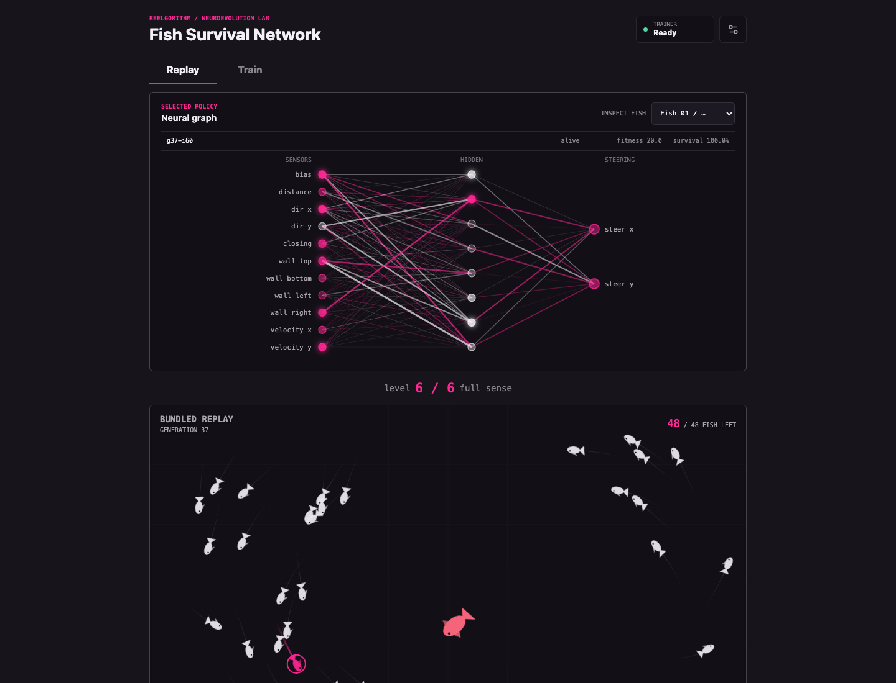
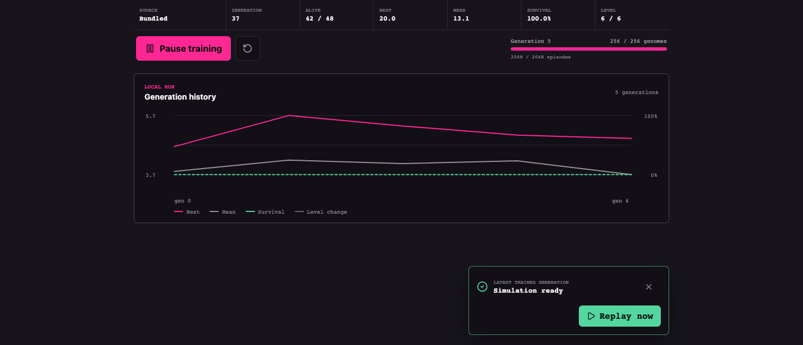

# Fish Survival Network

Fish Survival Network is an interactive browser lab where small neural networks learn to steer a fish away from a scripted predator. You can watch the bundled trained population immediately, inspect a fish's live neural activations, or start a new evolutionary run entirely on your machine.

Each fish policy receives 11 sensor values, passes them through an 8-node hidden layer, and produces two steering outputs. Training, replay, and checkpoint storage are local; no account or remote service is required.



## What You Can Do

- Replay a bundled Level 6 population without waiting for training.
- Select any visible fish and inspect its active nodes and 104 weighted edges.
- Train a new population in a browser worker while replay remains responsive.
- Change the population, episode count, mutation, seed, and curriculum settings.
- Resume the last completed local generation from IndexedDB after a reload.

## How Learning Works

The training loop is deterministic for a given run seed and configuration:

1. Create a population of fixed-shape `11 -> 8 -> 2` neural-network policies.
2. Evaluate each policy as **one fish at a time** against the scripted predator. Every policy in a generation receives the same seeded episode scenarios.
3. Score survival time, episode survival, predator distance, wall collisions, and steering effort.
4. Rank the policies, preserve the elites, and create the next generation through seeded tournament selection, crossover, and mutation.
5. Save the completed generation and make its best 48 policies available for replay.

Training and replay intentionally show different situations. Training evaluates one candidate fish per episode so policies can be compared fairly. Replay places the ranked top 48 together so you can inspect the generation as a population. The replay's fish counter is therefore not the training population size or training progress.

```text
Train tab                          Replay tab
---------                          ----------
one policy + scripted predator     top 48 policies + scripted predator
        |                                      |
seeded evaluation and fitness      replay worker snapshots at 15 Hz
        |                                      |
selection + crossover + mutation   PixiJS interpolation and interaction
        |
completed checkpoint in IndexedDB
        |
new replay roster
```

## Quick Start

### Requirements

- Node.js 20.19 or newer
- npm 10 or newer
- A WebGL-capable Chromium browser for the verified v1 experience

The repository pins the release runtime to Node.js 22.18.0 in [.nvmrc](.nvmrc) and npm 10.9.3 in [package.json](package.json).

### Run The Lab

```bash
nvm use
npm ci
npm run dev
```

Open [http://localhost:3000](http://localhost:3000). If you do not use `nvm`, select any Node.js version supported by `package.json` before running `npm ci`.

The first screen should report `Ready` and begin the bundled Level 6 replay. You do not need to train anything first.

## First Five Minutes

1. Stay on **Replay** and select a fish in the tank or the fish menu. The neural graph follows that exact policy and updates as the fish senses and steers.
2. Use Play/Pause, Restart, and `0.5x`/`1x`/`2x` to inspect the replay. A replay episode continues until every fish is caught; only then does the next episode start automatically. Before that boundary, it restarts only when you select Restart.
3. Open **Train** and select **Start training** or **Resume training**. The lab creates or restores a separate local run; it does not continue from or modify the bundled starter.
4. Watch the genome and episode counters advance. Training yields between four-genome chunks so the controls and replay remain responsive.
5. When a generation is ready, choose **Replay now** to switch immediately, or leave the current replay running and let the new roster wait until every visible fish is caught or you restart.

The settings button changes the run seed, population, evaluation, mutation, curriculum, and reduced-effects options. Replacing a run that already has progress requires confirmation because its completed checkpoint and history are cleared.



## Key Terms

| Term | Meaning in this project |
| --- | --- |
| Policy / genome | One fish's fixed neural-network weights and biases. |
| Episode | One seeded fish-versus-predator evaluation. Training episodes last at most 15 simulated seconds. |
| Generation | One complete evaluation of the population followed by reproduction. |
| Elite | A top-ranked policy copied into the next generation without mutation. |
| Champion | The highest-fitness evaluated policy in a generation. |
| Curriculum level | A value from 0 to 6 that progressively unlocks sensor groups. |
| Checkpoint | The resumable state saved only after a generation is complete. |
| Replay roster | The ranked top 48 evaluated policies shown together in the tank. |
| Replay source | An owned snapshot of a roster, generation, level, seed, and identity metadata. |

## Project Map

| Path | Responsibility | Start here |
| --- | --- | --- |
| `src/app/` | Next.js route, metadata, and global styling | [App route](src/app/page.tsx) |
| `src/components/` | React lab controls, graph, tank boundary, settings, and metrics | [Evolution lab](src/components/EvolutionLab/EvolutionLab.tsx) |
| `src/simulation/` | Deterministic physics, sensors, spawning, and scripted steering | [Simulation guide](src/simulation/README.md) |
| `src/evolution/` | Genome evaluation, fitness, population, curriculum, and genetics | [Evolution guide](src/evolution/README.md) |
| `src/replay/` | Replay source contract, protocol, worker engine, and client | [Replay guide](src/replay/README.md) |
| `src/workers/` | Trainer protocol, cooperative engine, React hook, and recovery client | [Trainer worker guide](src/workers/README.md) |
| `src/rendering/` | Imperative PixiJS scene, interpolation, particles, and selection | [Architecture](docs/architecture.md) |
| `src/persistence/` | Strict checkpoint codec and IndexedDB/in-memory repositories | [Checkpoint format](docs/checkpoint-format.md) |
| `src/starter/` | Bundled Level 6 recipe, server loading, and validation | [Bundled starter](#bundled-level-6-starter) |
| `scripts/` | Node entry points for simulations, evolution, and starter maintenance | [Commands](#commands) |
| `tests/e2e/` | Responsive, visual, interaction, and performance browser checks | [Release verification](docs/release-verification.md) |

The deterministic simulation, evolution, and serialization modules do not depend on React, PixiJS, or browser globals. The same core therefore runs in browser workers, Node scripts, and unit tests. See [Architecture](docs/architecture.md) for the complete data flow and determinism contract.

## Commands

### Everyday Development

```bash
npm run dev               # Start the local Next.js server
npm run build             # Create the production build
npm start                 # Run a completed production build
npm run lint              # Run ESLint
npm run lint:fix          # Apply safe ESLint fixes
npm run typecheck         # Run TypeScript without emitting files
npm test                  # Run Vitest once
npm run test:coverage     # Run Vitest with text and HTML coverage
npm run test:watch        # Run Vitest in watch mode
npm run test:e2e          # Run Playwright against its local test server
npm run test:e2e:install  # Install the verified Chromium test browser
```

Playwright starts its own server on `127.0.0.1:3100`. Stop a manual development server from this repository before `npm run test:e2e`; concurrent Next.js processes can contend for the same `.next` development lock.

### Domain And Release Tools

```bash
npm run simulate -- 42     # Run one scripted episode with seed 42
npm run evolve:once -- 42  # Evaluate and reproduce one default generation
npm run validate:starter   # Validate the bundled artifact and checksums
npm run verify:release     # Run every release gate in sequence
```

`npm run train:starter` is a maintainer operation that intentionally regenerates the checked-in starter JSON and checksum sidecar. Do not use it as the normal way to start training in the browser or as an incidental release step.

## Defaults

### Simulation

| Setting | Default |
| --- | --- |
| World | `1000 x 700` units |
| Fixed timestep | `1/60` second |
| Training evaluation | 900 steps / 15 simulated seconds |
| Visible replay | No time cutoff; continues until all fish are caught |
| Replay snapshot rate | 15 Hz |
| Packed snapshot size | 832 bytes |

Spawns, scripted predator steering, wall impacts, catches, and observations are reproducible from the episode seed. The renderer interpolates the latest two worker snapshots on `requestAnimationFrame`; simulation positions do not flow through React.

### Evolution

| Setting | Default |
| --- | --- |
| Network | 11 inputs, 8 hidden nodes, 2 outputs, `tanh` activations |
| Population | 256 policies |
| Episodes per policy | 8 shared deterministic seeds |
| Elites | 13 |
| Tournament size | 5 |
| Crossover probability | `0.65` |
| Per-parameter mutation probability | `0.12` |
| Mutation standard deviation | `0.18` |

Automatic curriculum progression unlocks a new sensor group after five consecutive generations reach a median survival rate of at least `0.75`. The [Evolution guide](src/evolution/README.md) explains the generation lifecycle and invariants.

## Bundled Level 6 Starter

A clean first launch replays a ranked 48-fish roster extracted from the checked-in Level 6 checkpoint. The server validates the full artifact, then sends only an owned replay source and metric history to the client. Local browser training starts independently in IndexedDB and never mutates or resumes from the bundle.

Validate the artifact without changing it:

```bash
npm run validate:starter
```

<details>
<summary>Starter recipe and integrity values</summary>

The artifact uses run seed `85622289`. Its fixed recipe trains three generations at each level from 0 through 5, then twenty generations at Level 6. It selects the champion from evaluated generation 37 and stores generation 38 as the resumable artifact state; held-out results never control the stopping point.

Pinned held-out validation records 7 survivors across 8 episodes and `13.447916666666666` mean alive seconds.

- Artifact: `src/starter/artifacts/level-6-starter.v1.json`
- Artifact SHA-256: `f9d2c8e671da1bbd40ff2c5143366446083cfd30101e29d214c1d75fb53f0212`
- Champion Float32 parameter SHA-256: `9cc42380e7c336eba899458a4fcaf1fa97bdf415cc00adfd21464380f2a6cbb3`

Regeneration takes roughly 35 seconds on the recorded development machine. The command writes canonical JSON and the checksum sidecar only after the checkpoint passes structural and held-out validation.

</details>

## Checkpoints And Local Data

The browser keeps one active run in IndexedDB. A checkpoint contains the complete population, seeded random-number-generator state, evolution and world configuration, curriculum archives, metric history, and the optional top-48 replay source. Float32 parameters use canonical little-endian Base64 so JSON artifacts and IndexedDB records share one strict Zod validation path.

Only finalized post-reproduction state is resumable; partial generation results never enter a checkpoint. Invalid or unknown records are quarantined. If IndexedDB is unavailable or a write fails, training continues in memory for the current browser session and the UI reports that it is not persisted. Worker crashes recover from the last completed checkpoint in a paused state.

See [Checkpoint Format](docs/checkpoint-format.md) for the schema and compatibility rules.

## Browser Support

Chromium is the verified v1 browser target. Playwright covers desktop, tablet, and mobile Chromium viewports, but this does not claim compatibility with Safari, Firefox, or their mobile engines.

The full lab requires Web Workers, transferable `ArrayBuffer` values, IndexedDB, `structuredClone`, `ResizeObserver`, `requestAnimationFrame`, and WebGL. Development and production builds explicitly use Webpack because the worker entries rely on `new Worker(new URL(...))` handling.

## Troubleshooting

| Symptom | What to check |
| --- | --- |
| `npm ci` rejects the runtime | Run `nvm use`, or install a Node.js version allowed by `package.json`. |
| Playwright cannot find Chromium | Run `npm run test:e2e:install`. On Linux/CI, use `npx playwright install --with-deps chromium`. |
| Next.js reports `.next/dev/lock` | Stop the other development or Playwright server for this repository, then retry. |
| Port 3000 is already in use | Run `npm run dev -- --port 3001` and open the reported URL. |
| Training says it is not persisted | Allow IndexedDB/storage for the local origin. The current run still works in memory for that session. |
| The tank is blank or the lab cannot start | Confirm that WebGL and Web Workers are enabled in a supported Chromium browser. |
| Visual screenshots differ on Linux | The checked-in release baselines are certified on macOS; review platform-specific Linux baselines before accepting them. |

## V1 Scope

V1 evolves fish policies against one scripted predictive predator, trains locally in browser workers, stores one active local run, and replays ranked 48-fish generations. The bundled starter, live graph, metrics, responsive controls, reduced-effects mode, and checkpoint recovery are included.

Predator evolution, alternating coevolution, hall-of-fame opponents, generation scrubbing, replay/video export, TensorFlow.js, and NEAT are intentionally out of scope for v1.

## Further Documentation

- [Architecture and determinism](docs/architecture.md)
- [Checkpoint format and compatibility](docs/checkpoint-format.md)
- [Release verification and recorded evidence](docs/release-verification.md)
- [Simulation subsystem](src/simulation/README.md)
- [Evolution subsystem](src/evolution/README.md)
- [Replay subsystem](src/replay/README.md)
- [Trainer worker subsystem](src/workers/README.md)

## License

Licensed under the [Apache License 2.0](LICENSE).
